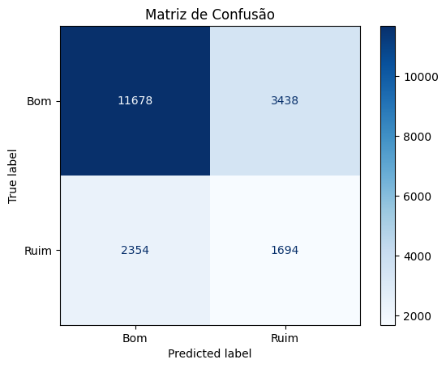

# Pipeline de Dados & Modelo Preditivo — Experiência do Cliente no E-commerce Brasileiro

[🇬🇧 English Version](README.md)

Pipeline de dados end-to-end construído sobre o dataset público da Olist (99 mil pedidos), aplicando Medallion Architecture (Bronze → Silver → Gold), modelo preditivo de Random Forest e dashboard interativo para responder: **"O que faz um cliente brasileiro ter uma experiência ruim com um pedido online — e dá pra prever isso antes de acontecer?"**

---

## Tecnologias


---

## Arquitetura

O pipeline foi implementado em duas versões:

**Local (pandas + SQLite)**
Os 9 CSVs do dataset Olist são ingeridos via pandas e SQLAlchemy para uma base SQLite (camada Bronze). Em seguida, regras de qualidade de dados são aplicadas e o resultado é persistido em uma segunda base SQLite (camada Silver). Por fim, uma query SQL com CTEs e agregações modela a tabela `fact_orders` na camada Gold, pronta para consumo pelo modelo e pelo dashboard.

**Cloud (PySpark + Databricks)**
Os mesmos CSVs são carregados em um Volume do Unity Catalog no Databricks e ingeridos como tabelas Delta Lake (Bronze). As transformações Silver e Gold são executadas em notebooks PySpark com Spark SQL, aproveitando o ambiente serverless da plataforma.

A tabela Gold alimenta um modelo de classificação Random Forest treinado com scikit-learn, que prevê se um pedido resultará em avaliação ruim com base em features como frete, tempo de entrega e atraso. Os resultados são expostos em um dashboard interativo publicado no Streamlit Community Cloud.

---

## Resultados

A análise de **99.441 pedidos** revelou que **22,7% dos clientes tiveram uma experiência ruim** (avaliação ≤ 3), com apenas **7,9% dos pedidos chegando com atraso**.

Estados do Norte e Nordeste (RR, AP, AM) têm os maiores tempos médios de entrega — acima de 25 dias — enquanto SP tem a entrega mais rápida, com média de 8 dias.

### Modelo Preditivo

O modelo de Random Forest foi treinado com **19.164 pedidos** — subconjunto dos dados completos após remoção de registros com valores nulos em features essenciais como tempo de entrega e avaliação.

Os principais fatores identificados pelo modelo:

- **Frete (58%)** — fator mais determinante para avaliação ruim
- **Tempo de entrega (24%)** — segundo fator mais relevante
- **Atraso (6%)** — pedidos atrasados têm avaliação média de 2.6 vs 4.2 no prazo
- **Tempo de aprovação (4%)** — impacto menor mas presente

> **Conclusão:** A experiência ruim no e-commerce brasileiro é primariamente um problema logístico — frete caro e entrega demorada explicam mais de 80% das avaliações negativas.

---

## Performance do Modelo

**Acurácia geral: 70%**

| Classe | Precision | Recall | F1-Score | Support |
|--------|-----------|--------|----------|---------|
| Bom (0) | 0.83 | 0.77 | 0.80 | 15.116 |
| Ruim (1) | 0.33 | 0.42 | 0.37 | 4.048 |

A métrica prioritária é o **Recall da classe Ruim (42%)** — o modelo consegue identificar 42% dos pedidos que resultarão em avaliação negativa antes de acontecer.

A limitação principal é o desbalanceamento dos dados — 79% dos pedidos são avaliações boas, o que dificulta o aprendizado da classe minoritária. Adicionalmente, o dataset Olist não contém informações sobre qualidade do produto ou reputação do vendedor — fatores que provavelmente influenciam a experiência mas não estão disponíveis para o modelo.



---

## Dashboard

Acessa o dashboard interativo em produção:

🔗 **[olist-customer-experience.streamlit.app](https://olist-customer-experience.streamlit.app)**

---

## Como Rodar o Projeto

### Pré-requisitos
- Python 3.10+
- Git

### Passo a passo

**1 — Clonar o repositório**
```bash
git clone https://github.com/enzomenezes03-lab/pipeline-ecommerce-olist.git
cd pipeline-ecommerce-olist
```

**2 — Criar e ativar o ambiente virtual**
```bash
python -m venv .venv
.venv\Scripts\activate  # Windows
```

**3 — Instalar as dependências**
```bash
pip install -r requirements.txt
pip install pandas sqlalchemy scikit-learn streamlit plotly joblib matplotlib
```

**4 — Baixar o dataset**

Acessa [este link no Kaggle](https://www.kaggle.com/datasets/olistbr/brazilian-ecommerce), baixa o dataset e extrai os 9 arquivos CSV dentro da pasta `data/raw/`.

**5 — Rodar o pipeline**
```bash
python src/ingest_bronze.py
python src/transform_silver.py
python src/modeling_gold.py
```

**6 — Treinar o modelo**
```bash
python src/predict_bad_review.py
```

**7 — Rodar o dashboard localmente**
```bash
streamlit run dashboard/app.py
```
